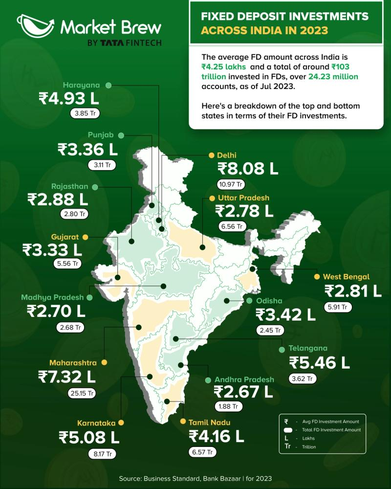

# Consumer Data

## Fixed Deposits

- In 2017, SEBI conducted a survey to understand investor behaviour. It found that more than 95% of households preferred to park their funds in fixed deposits, with only 10% preferring mutual funds and stocks.

### Types of Fixed Deposits (FDs) in India

1. **Regular Fixed Deposit**  
2. **Tax-Saving Fixed Deposit**  
3. **Senior Citizen Fixed Deposit**  
4. **Flexi Fixed Deposit**  
5. **Cumulative Fixed Deposit**  
6. **Non-Cumulative Fixed Deposit**  
7. **Corporate Fixed Deposit**  
8. **NRE (Non-Resident External) Fixed Deposit**  
9. **NRO (Non-Resident Ordinary) Fixed Deposit**  
10. **FCNR (Foreign Currency Non-Resident) Fixed Deposit**  

### Eligible Candidates for Opening an FD in India

1. **Resident Individuals (Indian Citizens)**  
2. **Hindu Undivided Families (HUFs)**  
3. **Minors (With Guardian)**  
4. **Senior Citizens**  
5. **Sole Proprietors**  
6. **Partnership Firms**  
7. **Private & Public Limited Companies**  
8. **Trusts & Societies**  
9. **Non-Resident Indians (NRIs)**  
10. **Overseas Citizens of India (OCI) & Persons of Indian Origin (PIOs)**

### Fixed Deposits Across India in 2023

# Home Loans

### India Home Loan Industry Segmentation 

Source: https://www.mordorintelligence.com/industry-reports/india-home-loan-market

1. **By Customer Type**:

    - Salaried
    - Self-Employed
      
2. **By Source**:
      
    - Bank
    - Housing Finance Companies (HFC's)
      
3. **By Interest Rate**:
      
    - Fixed Rate
    - Floating Rate
      
4. **By Tenure**:
      
    - Upto 5 Years
    - 6 - 10 Years
    - 11 - 24 Years
    - 25 - 30 Years
    
     
    